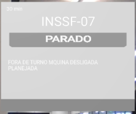
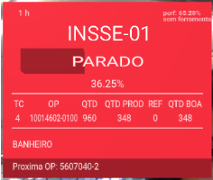

# ARintelmes

Escaneie o QR code ou acesse o site [https://arintelmes.glitch.me](https://arintelmes.glitch.me) para obter informações da máquina:

## Descrição do projeto:

Projeto em realidade aumentada para exibir informações de máquinas de forma rápida.

- `index.html` → Página principal, com elementos A-FRAME em realidade aumentada na câmera, utilizando AR.js.
- `index.js` → Script com endpoints.

## Objetivos:
- [x] Ler o QR Code pela câmera do celular e redirecionar para o site.
- [x] Ao abrir o site, exibir a aplicação (`a-scene`) em realidade aumentada, com fundo da câmera do celular via navegador.
- [x] Redimensionar a `a-scene` corretamente.
- [x] Conectar a aplicação com a API.
- [x] Criar endpoints.
- [x] Transformar as informações da máquina em realidade aumentada.
- [x] Testes no Glitch.
- [x] Endpoint dos gauges.
- [x] Endpoint das horas de funcionamento.
- [x] Verificar retorno da API das horas de funcionamento.
- [x] Cor da barra de produção.
- [ ] Inserir caracteres especiais no texto.
- [ ] Criar link para o AR de cada máquina.
- [ ] Gerar QR Code.

## Tecnologias:
- Javascript
- HTML
- A-FRAME
- AR.js

## Regras de negócio:

### Stop without orders

### Production without orders (sem item)

### Production with orders

### Stop but with orders

### Início de operação

### Troca de operação

### Inativo

## Pastas:

- `index.html` → Versão atual
- `script.js` → Versão atual
- `automatizationCheck` → Verificação do status das máquinas para teste

### path
É o caminho desenvolvido até a versão final.
- `main9` → Aplicação sem câmera, pegando diretamente da API
- `main8` → Aplicação sem câmera, fazendo uma requisição CORS temporária
- `main7` → Aplicação com/sem câmera, pegando diretamente da API
- `main6` → Aplicação com/sem câmera, fazendo uma requisição CORS temporária
- `main5` → Código atual, aplicação com câmera fazendo uma requisição CORS temporária, com estrutura quase pronta
- `main4` → Aplicação com câmera, fazendo requisições, com endpoints e formatação dos elementos ajustada
- `main3` → Aplicação com câmera, fazendo requisições, com endpoints e formatação dos elementos ajustada, e casos específicos da máquina, código aprimorado
- `main2` → Aplicação com câmera, fazendo requisições, com endpoints e formatação dos elementos ajustada, e casos específicos da máquina, mudança de biblioteca para melhor visualização, cores faltantes adicionadas
- `main1` → Aplicação com câmera, fazendo requisições, com endpoints e formatação dos elementos ajustada, e casos específicos da máquina, mudança de biblioteca para melhor visualização, cores faltantes adicionadas. Marcador adicionado, a câmera do celular direciona para o site, no site lê o marcador como o endereço MAC da máquina e atualiza os dados. Visual melhorado. Primeira versão finalizada!

### tests
- `area` → Editando o código, arquivo para o desenvolvimento.

### marker-test
Arquivos de teste com marcador.